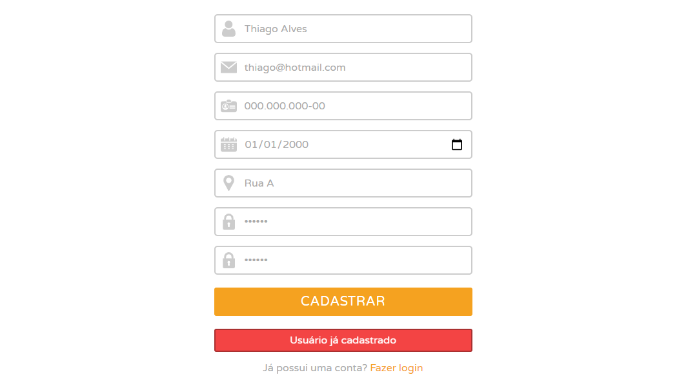

# Aplicação de Cadastro de Usuário
Projeto de teste para o processo seletivo de uma vaga de estágio na **[ADIN](https://www.adin.com.br/)/[ClaraVista](https://www.claravista.com.br/)**, utilizando [MongoDB](https://www.mongodb.com/) na base de dados, [Node.js](https://nodejs.org/) no back-end e [React](https://pt-br.reactjs.org/) no front-end.
***

## Instalação

1. Clone o repositório do projeto.

>`git clone https://github.com/thiago-alves-silva/react-user-registration.git`

2. Instale as dependências do servidor da API.

>`cd api-nodejs`

>`npm install`

3. Execute o servidor da API.

>`cd api-nodejs`

>`npm start`

Acesse a rota [http://localhost:3001/api/users](http://localhost:3001/api/users) e certifique-se de que o API está disponível. Um array *(inicialmente vazio)* deve ser retornado ao entrar a página. **Todos os usuários cadastrados serão exibidos e disponibilizados nessa rota.**

4. Instale as dependências da aplicação.

>`cd register-user`

>`npm install`

5. Execute a aplicação *React*.

>`cd register-user`

>`npm start`

Uma página web será aberta na rota [http://localhost:3000/](http://localhost:3000/) com uma tela de login sendo exibida.

## Utilização
***

### Tela de Login

Caso não tenha um usuário cadastrado para fazer login, clique em **`Registre-se`**.
***

### Tela de cadastro
Todos os campos devem ser preenchidos para a realização do cadastro, seguindo as seguintes regras de preenchimento:
* O nome deve conter pelo menos 4 caracteres.
* Um formato de e-mail válido deve ser inserido (*nome@provedor*).
* O CPF deve conter no mínimo 11 caracteres *(sem pontuação)* e no máximo 14 caracteres *(com pontuação)*.
* A senha deve conter pelo menos 6 dígitos.
* A confirmação de senha deve ser identica à senha do campo anterior.

Após realizar o registro de um usuário, clique em **`Fazer login`** para entrar com o seu cadastro.
***

### Validação de campos na Tela de Login

***

### Login de usuário não cadastrado

***

### Validação de campos na Tela de Cadastro

***

### Usuário já cadastrado
Tentativas de cadastro que contenham um e-mail ou CPF já existente no banco de dados não serão registrados.

***

### Tela de Boas-Vindas
Ao efetuar o login com sucesso na aplicação será exibida uma tela de boas-vindas com o primeiro nome do usuário cadastrado.

Para efetuar o *logout* basta clicar no botão **`SAIR DA CONTA`** e será redirecionado para a tela de login novamente.
***

## Informações Adicionais
No front-end foi utilizada a biblioteca React com o auxilio das dependencias:
 * **Axios:** para efetuar as requisições no servidor da API.
 * **Formik:** para a manipulação de formulários.
 * **Yup:** para as validações de campos nos formulários.
 * **React Router DOM:** para o roteamento da aplicação.
 
 ***